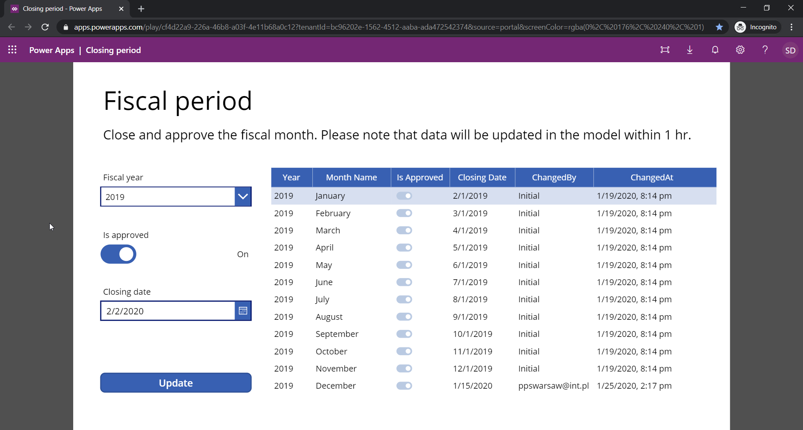

# Description
Demos from presentation called "Power uo your BI project with PowerApps"    
If you have any question please feel free to contact me at slawomirdrzymala@outlook.com

# Presentation
0. Slides (see presentation.pdf)

# Demo plan
1. Demo plan
    * I - Intro
        * 0 - Report (PowerBI app1 -> finance_powerapps_0.pbix)
    * II - Closing
        * 1 - Closing (PowerApp -> Closing period)
        * 2 - Closing Edit (PowerApp -> Closing period)
        * 3 - 1st-scenario (see 1st-scenario.png)    
    * III - Groups
        * 4 - Groups (PowerApp -> Custom groups)
        * 5 - Groups Flow Edit (PowerAutomate -> PowerAppToFunction)
        * 6 - 2nd-scenario (see 2nd-scenario.png)
        * 7 - Groups (PowerBI app2 -> finance_powerapps_1.pbix)
        * 8 - Groups (PowerBI app3 -> finance_powerapps_2.pbix + dashboard)
        * 9 - 3rd-scenario (see 3rd-scenario.png)
    * IV - ERP
        * 10 - ERP (PowerBI app4 -> finance_powerapps_3.pbix)
        * 11 - 4th-scenario (see 4th-scenario.png)
    * V - Issues
        * 12 - Issues (PowerBI app5 -> finance_powerapps_4.pbix)
        * 13 - Issues (Azure DevOps portal)
        * 14 - Issues (PowerAutomate -> PowerApp_CreateWorkItemAdvanced)
        * 15 - 5th-scenario (see 5th-scenario.png)
    * VI - PowerBI
        * 16 - PowerBI (PowerApp -> PowerBI)
        * 17 - 6th-scenario (see 6th-scenario.png)
    * VII - Master
        * 18 - PowerApp list (main powerapps page - list of application)
        * 19 - Master (PowerApp -> MasterApp)
    * VIII - Backup
        * 4 - Groups Backup (see backup-customgroup-saveandsend.gif)
        * 4 - Groups Flow History (PowerAutomate -> FlowPowerAppToFunction execution history)
        * 12 - Issues Backup (see backup-issues.gif)
        * 12 - Issues Flow History (PowerAutomate -> PowerApp_CreateWorkItemAdvanced execution history)

# PowerApps scenarios
2. Scenarios
    * 1st-scenario
    
    * 2nd-scenario
    
    * 3th-scenario
    
    * 4th-scenario
    
    * 5th-scenario
    
    * 6th-scenario
    

# PowerApps and PowerAutomate
2. PowerPlatform
    * 1_ClosingPeriod (see app backup)
    Application to specify the closind date for selected fiscal month. Application simply saves the data into the database.
    
    * 2_CustomGroups (see app backup)
    Application to set up custom account groups and the subgroups. Seconds screen allows to specify the mapping between subgroup and the accounts. The data are saved to database then using PowerAutomate the Azure function is executed to run ADF pipeline to move data to DWH database and then to run tabular model processing. Results from the flow are returned to the PowerApp. 
    
    
    
    * 3_ERPDetails (see app backup)
    Application that is presenting the data from so-called ERP system. Used to demonstrate interaction between PowerBI and PowerApps.
    
    * 4_CreateWorkItemAdvanced (see app backup)
    Application that is creating a new issue on AzureDevOps portal. Allows user to select and upload images from local disk and upload to AzureStorage and then paste to AzureDevOps.
    
    * 5_PowerBI (see app backup)
    Application to show PowerBI dashboard tiles inside PowerApp.
    
    
    * 6_MasterApp (see app backup)
    Application with link to the other applications.
    

# PowerBI reports
3. PowerBI
    * 1_finance_powerapps_0.pbix (see report)
    
    
    
    * 2_finance_powerapps_1.pbix (see report)
    
    * 3_finance_powerapps_2.pbix (see report)
    
    * 4_finance_powerapps_3.pbix (see report)
    
    * 5_finance_powerapps_4.pbix (see report)
    
    

# Azure
4. Azure
    * Resource group: powerup-bi-with-powerapps-dev
        * SQL Server: powerup-bi-with-powerapps-dev-sqlserv
            * SQL Database: dwhdb-dev (see bacpac)
            * SQL Database: powerappdb-dev (see bacpac)
        * Azure Analysis Services: poweruptabulardev
            * Model: demo-tabular (see backup)
        * Data factory: powerup-datafactory-demo-dev (see scripts)
        * App service: powerupbipowerappsdev
            * Function: PowerupDemoFunction (see scripts)
            * Kudu (additional libraries)
                * Microsoft.AnalysisServices.Core.DLL
                * Microsoft.AnalysisServices.DLL
                * Microsoft.AnalysisServices.Tabular.DLL
                * Microsoft.AnalysisServices.Tabular.Json.DLL
                * Microsoft.Azure.Management.DataFactory.dll
                * Microsoft.Azure.Management.ResourceManager.dll
                * Microsoft.IdentityModel.Clients.ActiveDirectory.dll
                * Microsoft.Rest.ClientRuntime.Azure.dll
                * Microsoft.Rest.ClientRuntime.dll
            * Application settings:
                * applicationId
                * AzureASConnString
                * subscriptionId
                * tenantID
        * Storage account
            * Container: flowcontainer
            * Container: ssas-backup